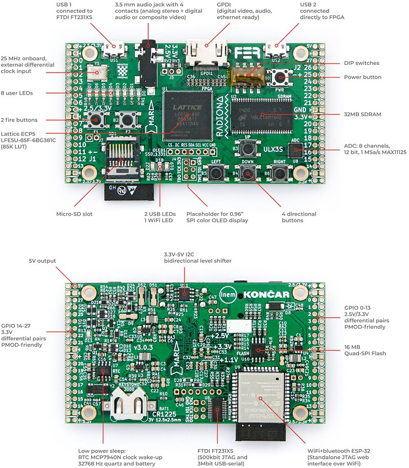

# TRS-80 Rev Z

**Cat. No. 26-2026** — *The last revision of the Model 1. The one Tandy never built.*

<br/>
*Photo: Thomas Gutmeier ([8bit-Homecomputermuseum](http://www.8bit-homecomputermuseum.at/computer/tandy_trs80_model1.html), Wien)*

An attempt to rebuild the **TRS-80 Model 1 (Revision G)** — fully expanded, as it stood
in 1980 — as open, verified hardware description on the
[ULX3S-85F](https://radiona.org/ulx3s/) (Lattice ECP5), using a fully open toolchain
(yosys · nextpnr-ecp5 · prjtrellis · Verilator). Not an emulator: the machine itself,
described in RTL, checked against the real schematics and against golden models.

## The idea in one paragraph

The existing TRS-80 FPGA cores each stop somewhere short of the machine I remember —
patched ROMs, flat memory arrays, no video snow, no mixed-density disks. Usually for
good reasons: their authors had different goals, and I've learned a lot from their work
(see [docs/RESEARCH.md](docs/RESEARCH.md) and [CREDITS.md](CREDITS.md)). This project
tries a specific combination: the Model 1 the way Tandy shipped it (**Goldstandard**:
Rev G, Level II BASIC 1.3, 48 KB, expansion interface, with all its quirks *including*
the snow), and, switchable, the revision Tandy never got around to (**Rev Z**: sensible
fixes and period-plausible extensions, each individually selectable, always reversible
to bit-exact stock behavior). Verification is not "looks right on screen" but byte-exact
comparison against golden models, predominantly George Phillips' trs80gp emulator, 
simulation before silicon.

## Where it stands

The machine is real: it boots TRSDOS 2.3 and NEWDOS/80 from SD card to
`DOS READY` on a physical ULX3S — monitor over HDMI, USB keyboard, mixed-density
and double-sided DMK disks, video snow included. The cassette is real too:
Space Invaders loads from a 500-baud WAV via `SYSTEM`, and `CSAVE`/`CLOAD`
round-trip byte-exact — read and write timing pinned against trs80gp. On top
sits a debug core that halts and single-steps the live Z80 from VS Code. And
if you have no board, the same RTL runs as an interactive desktop emulator
under Verilator ([`sim/emu/`](sim/emu/README.md)) — same machine, same disks,
same tapes, same debugger.

I can state all that plainly for the same reason I can be corrected on it:
checkmarks appear in this repository only when something runs *and is verified*
byte-exact against a golden model — never before. The spec has been wrong more
than once, and the corrections that got it here are logged in the open
([docs/RESEARCH.md](docs/RESEARCH.md)).

## Who built this and why

I'm a software person with decades of systems work behind me — but not a
microelectronics person. The TRS-80 Model 1 and Model III are the machines I
learned on as a kid (born 1968, grey boxes on the desk), and rebuilding this one
in RTL is how I finally understand its hardware for real. It is my first FPGA
project, carried by genuine enthusiasm for open source hardware and open
toolchains.

What holds it together is specification discipline: the reference configuration,
mode concept, and FDC architecture are worked out in [docs/SPEC.md](docs/SPEC.md),
the prior art is surveyed with sources ([docs/RESEARCH.md](docs/RESEARCH.md),
[CREDITS.md](CREDITS.md)), and the plan is in [ROADMAP.md](ROADMAP.md).

Most of the actual plumbing was written and tested with heavy AI assistance —
predominantly Anthropic's Claude in the Claude Code harness — and I say so
openly. My contribution is the machine I wanted built: a large scratchpad of
ideas, design principles, and trade-offs, plus the discipline that nothing gets
a checkmark without verification. Some Model-1-descendant systems reach for
hi-res graphics and 512 KB RAM; the trouble is that no period software ever
existed for them. This project goes the other way: first the machine as Tandy
shipped it, bit-exact, then the revision Tandy never built — one reversible
switch at a time. How I got from "I should finally learn Z-80 assembly" to
here is a story for another time and place.


## Scope

| Tier | Contents |
|---|---|
| **Committed, built and golden-verified** | Rev G mainboard · Level II 1.3 · 48 KB · video incl. snow · expansion interface · WD1771/1791 dual-controller FDC with **mixed-density** and **double-sided** disk support (DMK) · cassette (M2: 500-baud read/write, `.cas`+WAV, SD deck) · debug core with VS-Code integration · desktop emulator — all byte-exact against trs80gp |
| **Committed, next up** | ULX3S hardware smoke test · companion UI · Z-Bus — then RS-232-C (M5) · Centronics (M6) |
| **Vision** (direction, deliberately open) | ESP32 companion (untethered debug server, disk sources, telemetry, drive sound) · virtual expansion-card bus · TRS-IO/FreHD · PCG-80 · raster interrupt · CP/M (Omikron mapper + 64 KB Rev-Z board) · enclosure |

Details and reasoning in [ROADMAP.md](ROADMAP.md). What belongs in Rev Z is a standing
discussion — I'd genuinely like to hear what *your* "revision Tandy never built" would
contain.

## Try it

You don't need hardware to check any claim in this repository:

```
cd sim && make          # every core testbench
make golden             # byte-exact VRAM diff against trs80gp (local install)
make frames             # PNG frame dumps of the simulated screen
```

**No board?** You can also run the machine interactively on your desktop
using the Verilator-based SDL emulator in [`sim/emu/`](sim/emu/README.md):

```
cd sim/emu && make
./build/emu/Vm1_core --rom=/path/to/rom.hex --disk0=/path/to/newdos.dmk
```

An SDL2 window opens with the live TRS-80 display and keyboard input
(glyph-faithful mapping, mirroring the board's USB-HID front end). The
emulator can also script its own input (`--type='BASIC\n'`) and expose
the debug core on a pseudo-tty (`--debug-pty`) — so DeZog debugs the
simulated machine exactly like the physical board. See
[`sim/emu/README.md`](sim/emu/README.md) for all options.

With a [ULX3S-85F](boards/ulx3s/README.md#getting-a-board) (available via
Crowd Supply, Mouser, or the makers' own shop — see the board README),
`cd boards/ulx3s && make bit && make prog` puts the machine on real silicon:
HDMI out, USB keyboard, ROM and disk images from SD card, TRSDOS boot.

<br/>
*The ULX3S FPGA Board — designed by Radiona.org / Goran Mahovlić / Intergalaktik (Lattice ECP5 85F, 32 MB SDRAM, GPDI HDMI out, Micro-SD, FTDI USB debugging, ESP32 slot). Diagram/Photo: Radiona / Intergalaktik / Crowd Supply (Open Hardware).*

Play with it. Boot your disks, run your old programs, try to break it —
a report that something behaves differently from a real Model 1 (or from
trs80gp) is exactly the kind of contribution this project runs on.

## Debugging the machine

The machine has a debug core in the FPGA — halt and single-step the Z80,
hardware breakpoints and watchpoints, read and write registers and memory
while it runs, and it even notices when the target resets out from under
you. It is driven from VS Code through
[trszog](https://github.com/TechPrototyper/trszog) (a DeZog fork), over a
small published protocol — both the debugger-facing JSON-RPC layer and the
debug core's own binary wire protocol are documented in
[docs/DEBUG-PROTOCOL.md](docs/DEBUG-PROTOCOL.md), so you can attach a
different debugger, or drive the core directly. Today a reference bridge
(`tools/trszog_bridge.py`) connects the two over the board's FTDI serial
port — or over the desktop emulator's `--debug-pty`, which makes the
simulated machine just another debug target; a first-class trszog remote
type that starts the bridge for you is next (see
[ADR-0007](docs/decisions/0007-trszog-integration.md)). The architecture,
and the road to a dongle that debugs a *real* TRS-80 over a ribbon cable,
is in [ADR-0006](docs/decisions/0006-debug-architecture.md).

## How this is run

One maintainer, one specification, and a real interest in being corrected by
people who know this machine a lot better than I do — which, in this community, is a lot of
people. The specification keeps the project coherent; if you'd rather build a different
machine, the MIT license makes a fork easy and welcome. Take it and build something great!
Details in [GOVERNANCE.md](GOVERNANCE.md) and [CONTRIBUTING.md](CONTRIBUTING.md).

## Legal

- Code: **MIT** (see [LICENSE](LICENSE)); parts derived from prior work are used with the
  authors' explicit permission — see [CREDITS.md](CREDITS.md) and
  [licenses/permissions/](licenses/permissions/).
- **Model I Photo**: Thomas Gutmeier ([8bit-Homecomputermuseum](http://www.8bit-homecomputermuseum.at/computer/tandy_trs80_model1.html), Wien) — see [CREDITS.md](CREDITS.md).
- **ULX3S Board Diagram**: Radiona.org / Goran Mahovlić / Intergalaktik / Crowd Supply (Open Hardware) — see [CREDITS.md](CREDITS.md).
- **No ROMs in this repository.** Level II BASIC is copyrighted (Tandy/Microsoft). The
  design loads ROM images at runtime; [roms/README.md](roms/README.md) explains how to
  obtain and identify them legally.
- Tandy documentation is referenced, not redistributed — see
  [docs/RESOURCES.md](docs/RESOURCES.md) for the canonical archives.

*TRS-80 is a trademark of its respective owner; it is used here descriptively to identify
the historical machine being preserved.*
