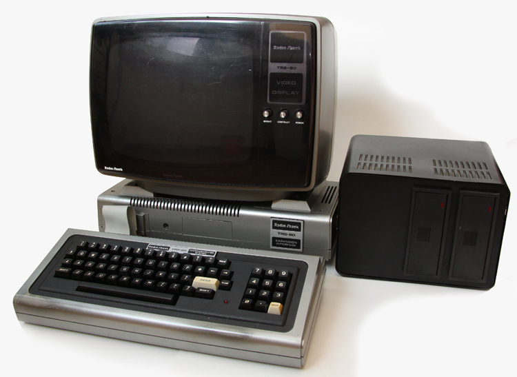

# TRS-80 Rev Z

**Cat. No. 26-2026** — *The last revision of the Model 1. The one Tandy never built.*

<br/>
*Photo: Thomas Gutmeier ([8bit-Homecomputermuseum](http://www.8bit-homecomputermuseum.at/computer/tandy_trs80_model1.html), Wien)*

An attempt to rebuild the **TRS-80 Model 1 (Revision G)** — fully expanded, as it stood
in 1980 — as open, verified hardware description on the
[ULX3S-85F](https://radiona.org/ulx3s/) (Lattice ECP5), using a fully open toolchain
(yosys · nextpnr-ecp5 · prjtrellis · Verilator). Not an emulator: the machine itself,
described in RTL, checked against the real schematics and against golden models.

## The idea in one paragraph

The existing TRS-80 FPGA cores each stop somewhere short of the machine I remember —
patched ROMs, flat memory arrays, no video snow, no mixed-density disks. Usually for
good reasons: their authors had different goals, and I've learned a lot from their work
(see [docs/RESEARCH.md](docs/RESEARCH.md) and [CREDITS.md](CREDITS.md)). This project
tries a specific combination: the Model 1 the way Tandy shipped it (**Goldstandard**:
Rev G, Level II BASIC 1.3, 48 KB, expansion interface, with all its quirks *including*
the snow), and, switchable, the revision Tandy never got around to (**Rev Z**: sensible
fixes and period-plausible extensions, each individually selectable, always reversible
to bit-exact stock behavior). Verification is not "looks right on screen" but byte-exact
comparison against golden models, predominantly George Phillips' trs80gp emulator, 
simulation before silicon.

## Who built this and why

I'm a software person, and an educated business person. While my background covers decades of building
systems in different roles, I am not into microelectronics. The TRS-80 Models 1 and III are
the machines I learnt on. I owned the grey boxes back then, as a child born in 1968,
and now I've rebuilt this one carefully in RTL, partly *in order to* finally understand
its hardware for real, partly because of the ehtusiasm I feel about Open Source Hardware and 
FPGAs. So this is my first FPGA project!

The machine as it stands boots NEWDOS/80 2.0 from SD card to `NEWDOS/80 READY` on a real ULX3S
 — Monitor attached over HDMI, with a USB keyboard. On top I built a debug core that halts and
 single-steps the live Z80 from VS Code. I can state that plainly for the same reason
I can be corrected on it: checkmarks appear in this repository when something runs *and is verified*
against a golden model — never before. The spec has been wrong more than once, and the corrections
that got it here are logged in the open ([docs/RESEARCH.md](docs/RESEARCH.md)).

What holds it together is specification discipline: the reference configuration, mode
concept, and FDC architecture are worked out ([docs/SPEC.md](docs/SPEC.md)), the prior
art is surveyed with sources ([docs/RESEARCH.md](docs/RESEARCH.md), [CREDITS.md](CREDITS.md)),
and the plan is in [ROADMAP.md](ROADMAP.md).

Most of actual plumbing was created and tested using frontier AI solutions, predominantly by
Anthropic's Claude in the Claude Code harness. And while this may be controversial for some,
I'm convinced it's a valid approach to learning, gaining personal insights, community contribution
and a lot of fun in the open hardware space. My genuine contribution was of course the desire to
have this built, and a large scratchpad full of ideas about what to build, how to build it,
design principles to follow and trade-offs to consider. I've seen some systems built on Model 1
principles reaching for High Resolution Graphics and 512KB RAM, yet the problem often is that
noone has ever built software for these systems. My core motivation all started when I tried
to move into Z-80 Assembler some years ago, and I will lay out the whole story how I got fromt his
moment to here at a different time and a different place.


## Scope

| Tier | Contents |
|---|---|
| **Committed** (specified, actively worked on) | M1–M3: Rev G mainboard · Level II 1.3 · 48 KB · video incl. snow · cassette · expansion interface · WD1771/1791 dual-controller FDC with **mixed-density** disk support (DMK) · Debug core with VS-Code integration *(almost completely built, live on hardware — see below)*
| **Vision** (direction, deliberately open) | ESP32 companion (untethered debug server, disk sources, telemetry, drive sound) · virtual expansion-card bus · TRS-IO/FreHD · PCG-80 · raster interrupt · CP/M (Omikron mapper + 64 KB Rev-Z board) · enclosure |

Details and reasoning in [ROADMAP.md](ROADMAP.md). What belongs in Rev Z is a standing
discussion — I'd genuinely like to hear what *your* "revision Tandy never built" would
contain.

## Try it

You don't need hardware to check any claim in this repository:

```
cd sim && make          # every core testbench
make golden             # byte-exact VRAM diff against trs80gp (local install)
make frames             # PNG frame dumps of the simulated screen
```

With a [ULX3S-85F](boards/ulx3s/README.md#getting-a-board) (available via
Crowd Supply, Mouser, or the makers' own shop — see the board README),
`cd boards/ulx3s && make bit && make prog` puts the machine on real silicon:
HDMI out, USB keyboard, ROM and disk images from SD card, TRSDOS boot.

Play with it. Boot your disks, run your old programs, try to break it —
a report that something behaves differently from a real Model 1 (or from
trs80gp) is exactly the kind of contribution this project runs on.

## Debugging the machine

The machine has a debug core in the FPGA — halt and single-step the Z80,
hardware breakpoints and watchpoints, read and write registers and memory
while it runs, and it even notices when the target resets out from under
you. It is driven from VS Code through
[trszog](https://github.com/TechPrototyper/trszog) (a DeZog fork), over a
small published protocol — both the debugger-facing JSON-RPC layer and the
debug core's own binary wire protocol are documented in
[docs/DEBUG-PROTOCOL.md](docs/DEBUG-PROTOCOL.md), so you can attach a
different debugger, or drive the core directly. Today a reference bridge
(`tools/trszog_bridge.py`) connects the two over the board's FTDI serial
port; a first-class trszog remote type that starts it for you is next (see
[ADR-0007](docs/decisions/0007-trszog-integration.md)). The architecture,
and the road to a dongle that debugs a *real* TRS-80 over a ribbon cable,
is in [ADR-0006](docs/decisions/0006-debug-architecture.md).

## How this is run

One maintainer, one specification, and a real interest in being corrected by
people who know this machine a lot better than I do — which, in this community, is a lot of
people. The specification keeps the project coherent; if you'd rather build a different
machine, the MIT license makes a fork easy and welcome. Take it and build something great!
Details in [GOVERNANCE.md](GOVERNANCE.md) and [CONTRIBUTING.md](CONTRIBUTING.md).

## Legal

- Code: **MIT** (see [LICENSE](LICENSE)); parts derived from prior work are used with the
  authors' explicit permission — see [CREDITS.md](CREDITS.md) and
  [licenses/permissions/](licenses/permissions/).
- **Model I Photo**: Thomas Gutmeier ([8bit-Homecomputermuseum](http://www.8bit-homecomputermuseum.at/computer/tandy_trs80_model1.html), Wien) — see [CREDITS.md](CREDITS.md).
- **No ROMs in this repository.** Level II BASIC is copyrighted (Tandy/Microsoft). The
  design loads ROM images at runtime; [roms/README.md](roms/README.md) explains how to
  obtain and identify them legally.
- Tandy documentation is referenced, not redistributed — see
  [docs/RESOURCES.md](docs/RESOURCES.md) for the canonical archives.

*TRS-80 is a trademark of its respective owner; it is used here descriptively to identify
the historical machine being preserved.*
